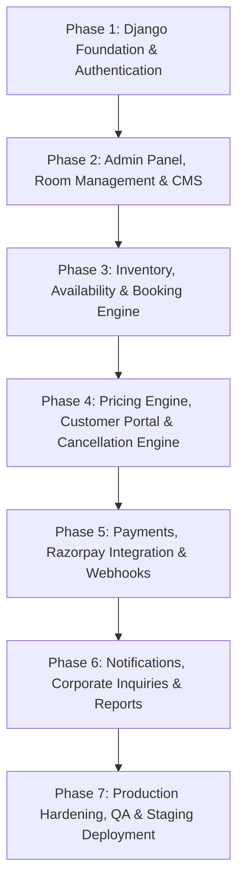

# Backend Implementation Roadmap & Major Phases

## 1. Roadmap Architecture
To ensure disciplined execution and rapid validation without overwhelming fragmentation, backend development is structured into **7 Major Sequential Phases**.

---

## 2. Phase Breakdown & Acceptance Criteria

### PHASE 1: Django Foundation + Authentication
- **Objective**: Establish Django 5.2 LTS project structure, SQLite dev database, modular app structure, standard response envelopes, Google OAuth2 customer authentication (via standard `django-allauth`), staff email/password login, and RBAC permission foundation.
- **Backend Deliverables**:
  - Django base configuration (`settings/base.py`, `settings/development.py`, `urls.py`, `.env.example`).
  - Core utilities: Standard success/error envelopes, global exception handlers, healthcheck endpoint (`/api/v1/health/`).
  - Apps: `apps.authentication`.
  - Models: Custom `User`, `CustomerProfile`, `StaffProfile` (roles: `SUPER_ADMIN`, `MANAGER`, `RECEPTIONIST`).
  - Google OAuth integration (`django-allauth` Google provider configuration using `GOOGLE_CLIENT_ID` and `GOOGLE_CLIENT_SECRET` environment variables, Sites framework, and SocialApp).
  - Endpoints:
    - `GET /api/v1/auth/csrf/` (CSRF cookie initialization & token retrieval).
    - `GET /accounts/google/login/` (Customer Google Sign-In initiation).
    - `GET /accounts/google/login/callback/` (Customer Google OAuth callback).
    - `POST /api/v1/auth/login/` (Staff & admin email/password login).
    - `POST /api/v1/auth/logout/` (Session termination).
    - `GET /api/v1/auth/me/` (Current user profile & session hydration).
    - `PATCH /api/v1/auth/profile/` (Customer profile updates).
- **Strict Phase 1 Exclusions (DO NOT Implement in Phase 1)**:
  - ❌ No booking engine or checkout holds
  - ❌ No inventory engine or RoomNightInventory
  - ❌ No pricing engine or dynamic quotes
  - ❌ No Razorpay integration or payment verification
  - ❌ No cancellation or refund engine
  - ❌ No CMS endpoints
  - ❌ No notification services
  - ❌ No corporate booking workflows
  - ❌ No offline walk-in booking workflow
  - ❌ No physical room assignment logic
  - ❌ No admin booking visual calendar
  - ❌ No Phone OTP or Email Magic Link
- **Automated Tests**: Google OAuth token exchange (mocked), staff authentication with PBKDF2, RBAC permission checks, secure session cookie lifecycle.
- **Definition of Done (DoD)**: Customer Google Sign-In and staff authentication pass all unit/API test suites with 0 errors.

---

### PHASE 2: Admin Panel + Room Management + Dynamic Content
- **Objective**: Implement physical room models (28 authoritative rooms: 20 AC, 8 Non-AC), room categories (derived total capacity), amenities, gallery media, and Headless CMS endpoints.
- **Backend Deliverables**:
  - Apps: `apps.rooms`, `apps.cms`.
  - Models: `RoomCategory`, `PhysicalRoom`, `Amenity`, `RoomImage`, `CMSSection`, `GalleryImage`, `FAQ`.
  - Derived read-only inventory property on `RoomCategory`.
  - Endpoints:
    - Public: `/api/v1/rooms/categories/`, `/api/v1/content/sections/`, `/api/v1/content/gallery/`, `/api/v1/content/faqs/`.
    - Admin: Full CRUD under `/api/v1/admin/rooms/`, `/api/v1/admin/content/`.
  - Initial database seed script for the 28 physical rooms.
- **Automated Tests**: Room category serializers, physical room CRUD, CMS endpoint caching, RBAC permission validations.
- **Definition of Done (DoD)**: Frontend can fetch real dynamic room categories and CMS marketing content; Admin can manage physical rooms.

---

### PHASE 3: Inventory + Availability + Booking Engine
- **Objective**: Implement the authoritative night-based inventory system calculated from active physical rooms, unified multi-channel inventory (online + walk-in), configurable temporary hold mechanics (default: 15 mins), and physical room allocation.
- **Backend Deliverables**:
  - Apps: `apps.inventory`, `apps.bookings`.
  - Models: `RoomBlock`, `MaintenanceBlock`, `Booking`, `BookingRoom`. *(Note: `RoomNightInventory` is not implemented as an independent manual data store; availability is derived dynamically across stay nights).*
  - Status:
    - **Step 1 (Domain Foundation) COMPLETE**: Domain models, state machine, stay night calculations, Django admin, and automated tests implemented and verified.
    - **Step 2 (Availability Engine & API) COMPLETE**: Central `AvailabilityService`, `/api/v1/availability/search/` and `/api/v1/availability/calendar/` endpoints, dynamic hold expiration, and comprehensive test suite implemented and verified.
    - **Step 3 (15-Minute Hold Engine & Public Booking Endpoints)**: Pending approval.
    - **Step 4 (Admin Walk-In & Room Assignment Endpoints)**: Pending approval.
  - Endpoints:
    - Public: `/api/v1/availability/search/`, `/api/v1/availability/calendar/`, `/api/v1/bookings/hold/`, `/api/v1/bookings/{ref}/?token={access_token}`.
    - Admin: `/api/v1/admin/calendar/matrix/`, `/api/v1/admin/rooms/block/`, `/api/v1/admin/bookings/walk-in/`, `/api/v1/admin/bookings/{id}/assign-room/`.
  - Background task / cron for expiring unconfirmed holds (>15 minutes).
- **Automated Tests**: Bottleneck night availability calculations, concurrent hold collision tests, hold release expiration, physical room assignment conflicts.
- **Definition of Done (DoD)**: Single unified inventory prevents double-booking across online and walk-in flows.

---

### PHASE 4: Pricing Engine + Customer Booking Account + Cancellation/Refund Logic
- **Objective**: Build the dynamic pricing calculation engine (base rates, extra adult/child surcharges, dynamic `TaxRule`), immutable price snapshots, customer booking dashboard, and configurable cancellation policy engine.
- **Backend Deliverables**:
  - Apps: `apps.pricing`.
  - Models: `RoomRatePlan`, `ExtraGuestChargeRule`, `TaxRule`, `MiscellaneousCharge`, `BookingPriceSnapshot`, `CancellationPolicy`, `CancellationPolicyRule`.
  - Endpoints:
    - Public: `/api/v1/pricing/calculate/`.
    - Customer: `/api/v1/customers/bookings/`, `/api/v1/customers/bookings/{id}/`, `/api/v1/customers/bookings/{id}/cancel/`.
    - Admin: `/api/v1/admin/pricing/rates/`, `/api/v1/admin/pricing/taxes/`, `/api/v1/admin/policies/cancellation/`.
- **Automated Tests**: Decimal pricing accuracy, extra guest charges, GST calculation via active TaxRule, immutable snapshot persistence, 48-hr vs same-day cancellation penalty calculation.
- **Definition of Done (DoD)**: Pricing calculations authoritative on backend; customers can view and initiate cancellations with accurate policy evaluations.

---

### PHASE 5: Razorpay + Payments + Payment Verification + Refund Processing
- **Objective**: Integrate Razorpay order generation, 6-checkpoint payment verification, HMAC-SHA256 signature checks, idempotent webhook processing, and admin refund management.
- **Backend Deliverables**:
  - Apps: `apps.payments`.
  - Models: `PaymentOrder`, `PaymentTransaction`, `RefundTransaction`, `WebhookEventLog`.
  - Endpoints:
    - Public/Customer: `/api/v1/payments/create-order/`, `/api/v1/payments/verify/`.
    - Webhook: `/api/v1/payments/webhook/`.
    - Admin: `/api/v1/admin/refunds/{id}/execute/`.
- **Automated Tests**: Razorpay client mocking, valid vs invalid signature checks, idempotent webhook execution, refund state machine transitions.
- **Definition of Done (DoD)**: End-to-end checkout loop holds inventory, verifies payment, transitions booking to `CONFIRMED`, or releases inventory on failure/timeout.

---

### PHASE 6: Notifications + Corporate Booking + Reports
- **Objective**: Implement transactional notification service hooks (Email, WhatsApp/MSG91), corporate bulk inquiry intake, and admin KPI reporting.
- **Backend Deliverables**:
  - Apps: `apps.corporate`, `apps.notifications` (or core notification service).
  - Models: `CorporateInquiry`, `CorporateNegotiatedRate`, `AuditLog`.
  - Endpoints:
    - Public: `/api/v1/corporate/inquire/`.
    - Admin: `/api/v1/admin/corporate/inquiries/`, `/api/v1/admin/dashboard/stats/`, `/api/v1/admin/audit-logs/`.
- **Automated Tests**: Corporate inquiry submission, notification dispatch mocks, report aggregation queries (occupancy & revenue).
- **Definition of Done (DoD)**: Hotel management can review corporate leads, view business KPIs, and trace system audits.

---

### PHASE 7: Production Hardening + Integration + Full QA
- **Objective**: Finalize PostgreSQL production configuration, CORS/CSRF hardening, Redis caching & Celery task queues, Docker setup, and full end-to-end regression validation.
- **Backend Deliverables**:
  - Production settings (`settings/production.py`), PostgreSQL database configuration.
  - Sentry error monitoring integration.
  - Gunicorn / Uvicorn + Nginx reverse proxy configuration.
  - End-to-end integration tests with the React customer frontend and React admin panel.
- **Definition of Done (DoD)**: 100% test pass rate, 0 critical security issues, zero performance bottlenecks, system ready for production deployment.
