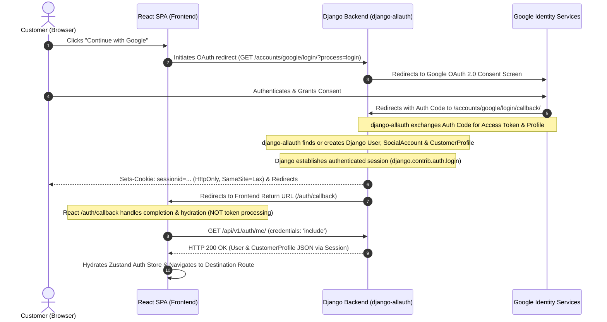

# Authentication & Role-Based Access Control (RBAC) Specification

## A. Authentication Architecture

The Manohar Grand Hotel platform uses a decoupled architecture with a **React + TypeScript SPA frontend** and a **Django 5.2 LTS + Django REST Framework (DRF) backend**.

- **Application Session**: Django's built-in session authentication (`django.contrib.sessions` & `django.contrib.auth`) is the **sole authoritative session mechanism** for both customers and staff.
- **No Client JWT Storage**: Authentication state is **never** maintained via JWT tokens in client-side `localStorage`. Instead, authentication is maintained via secure, `HttpOnly` browser session cookies (`sessionid`).
- **Google OAuth Engine**: **`django-allauth`** is the sole authoritative Google OAuth 2.0 integration library. No custom Google token verification logic or secondary OAuth libraries (such as `dj-rest-auth` or `SimpleJWT`) are introduced.

```
+-----------------------------------------------------------------------------------+
|                              AUTHENTICATION TOPOLOGY                              |
|                                                                                   |
|  +---------------------------+             +-----------------------------------+  |
|  |     Customer (Guest)      |             |         Staff / Admin             |  |
|  |  "Continue with Google"   |             |       Email + Password            |  |
|  +-------------+-------------+             +-----------------+-----------------+  |
|                |                                             |                    |
|                v                                             v                    |
|  +---------------------------+             +-----------------------------------+  |
|  |  django-allauth (Google)  |             |  Django Auth Backend (PBKDF2)     |  |
|  |  - Sites Framework (ID 1) |             |  - StaffProfile Verification      |  |
|  |  - SocialApp (Env Secrets)|             |  - RBAC Permission Enforcement    |  |
|  +-------------+-------------+             +-----------------+-----------------+  |
|                |                                             |                    |
|                +----------------------+----------------------+                    |
|                                       v                                           |
|                   +---------------------------------------+                       |
|                   |  Django Session Engine (django_session) |                     |
|                   |  - Issues HttpOnly `sessionid` Cookie |                       |
|                   |  - Exposes `request.user` to DRF Views|                       |
|                   +---------------------------------------+                       |
+-----------------------------------------------------------------------------------+
```

---

## B. Exact Google Authentication & React Callback Sequence

The customer Google authentication flow follows a single, coherent OAuth 2.0 Authorization Code redirect flow orchestrated natively by `django-allauth`.



### Complete Sequence Description:
1. **Initiation**: Customer clicks "Continue with Google" on the React website. React navigates the browser:
   ```ts
   window.location.href = `${BACKEND_URL}/accounts/google/login/?process=login`;
   ```
2. **Google Consent**: Google displays the OAuth consent dialog to the customer.
3. **django-allauth Callback**: Upon consent, Google redirects the browser to `/accounts/google/login/callback/` with the authorization code.
4. **Token Exchange & User Resolution**: `django-allauth` server-side exchanges the authorization code with Google's token endpoint, retrieves identity metadata, and finds or creates the corresponding `User`, `SocialAccount`, and `CustomerProfile`.
5. **Session Establishment**: Django executes `django.contrib.auth.login(request, user)`, persisting the session in `django_session` and setting the `sessionid` cookie (`HttpOnly`, `SameSite=Lax`, `Secure` in production).
6. **Redirect to React `/auth/callback`**: Django redirects the browser to the React route: `${FRONTEND_URL}/auth/callback` (configured via `LOGIN_REDIRECT_URL`).
7. **Hydration (Completion Route)**: The React component mounted at `/auth/callback` acts purely as an **authentication completion and state hydration route** (it does **not** process OAuth tokens). It issues:
   ```ts
   // In React /auth/callback component:
   const res = await api.get('/api/v1/auth/me/'); // credentials: 'include'
   setAuthUser(res.data.data);
   navigate('/checkout'); // or original redirect target
   ```
8. **Session Verification**: Django identifies the customer via the `sessionid` cookie attached to the request, returns the customer profile JSON, and React completes the sign-in flow.

---

## C. CSRF Protection & Initialization Endpoint

To ensure seamless CSRF handling between the decoupled React SPA and Django:

### 1. CSRF Initialization Endpoint: `GET /api/v1/auth/csrf/`
- **Purpose**: Provides a safe, idempotent mechanism for the React SPA to initialize or refresh the Django CSRF cookie before making state-mutating requests.
- **Backend Implementation View**:
  ```python
  from django.middleware.csrf import get_token
  from django.views.decorators.csrf import ensure_csrf_cookie
  from rest_framework.decorators import api_view, permission_classes
  from rest_framework.permissions import AllowAny
  from rest_framework.response import Response

  @api_view(['GET'])
  @permission_classes([AllowAny])
  @ensure_csrf_cookie
  def get_csrf_token(request):
      return Response({
          "success": True,
          "csrfToken": get_token(request)
      })
  ```
- **Cookie & Header Mechanics**:
  - Django emits `csrftoken` cookie with `CSRF_COOKIE_HTTPONLY = False` and `CSRF_COOKIE_SAMESITE = 'Lax'`.
  - For all mutating HTTP requests (`POST`, `PUT`, `PATCH`, `DELETE`), the React API client reads the `csrftoken` cookie (or uses the returned token) and attaches it in the `X-CSRFToken` request header.

---

## D. Deployment Domains & Environment Configuration

> [!IMPORTANT]
> Specific domain names are **deployment configuration** and must **never** be hardcoded into the application codebase.

All hostnames, origins, and redirect URIs are configured via environment variables:

```ini
# Deployment Domains (Configurable per environment)
FRONTEND_URL=http://localhost:5173
BACKEND_URL=http://localhost:8000

# Django Core Host & Origin Whitelisting
ALLOWED_HOSTS=localhost,127.0.0.1,.yourdomain.com
CORS_ALLOWED_ORIGINS=http://localhost:5173,https://yourdomain.com,https://admin.yourdomain.com
CSRF_TRUSTED_ORIGINS=http://localhost:5173,https://yourdomain.com,https://admin.yourdomain.com

# Google OAuth Credentials (Provided from Google Cloud Console)
GOOGLE_CLIENT_ID=your-google-client-id.apps.googleusercontent.com
GOOGLE_CLIENT_SECRET=your-google-client-secret
```

### Google OAuth Redirect URI Configuration (Google Cloud Console):
- **Development**: `${BACKEND_URL}/accounts/google/login/callback/` (e.g. `http://localhost:8000/accounts/google/login/callback/`)
- **Production**: `${BACKEND_URL}/accounts/google/login/callback/` (e.g. `https://api.yourdomain.com/accounts/google/login/callback/`)

---

## E. django-allauth Version Compatibility & Configuration

The project targets modern **`django-allauth` (>= 65.0.0 LTS compatible)**. The following configuration ensures standard, supported account linking and zero duplicate user creation:

```python
# settings/base.py
INSTALLED_APPS += [
    'django.contrib.sites',
    'allauth',
    'allauth.account',
    'allauth.socialaccount',
    'allauth.socialaccount.providers.google',
]

SITE_ID = 1

# django-allauth Authentication & Account Linking Rules
ACCOUNT_AUTHENTICATION_METHOD = 'email'
ACCOUNT_EMAIL_REQUIRED = True
ACCOUNT_UNIQUE_EMAIL = True
ACCOUNT_USERNAME_REQUIRED = False
ACCOUNT_USER_MODEL_USERNAME_FIELD = None

SOCIALACCOUNT_AUTO_SIGNUP = True
SOCIALACCOUNT_EMAIL_AUTHENTICATION = True
SOCIALACCOUNT_EMAIL_AUTHENTICATION_AUTO_CONNECT = True

SOCIALACCOUNT_PROVIDERS = {
    'google': {
        'APP': {
            'client_id': os.environ.get('GOOGLE_CLIENT_ID', ''),
            'secret': os.environ.get('GOOGLE_CLIENT_SECRET', ''),
            'key': ''
        },
        'SCOPE': [
            'profile',
            'email',
        ],
        'AUTH_PARAMS': {
            'access_type': 'online',
        }
    }
}

LOGIN_REDIRECT_URL = f"{os.environ.get('FRONTEND_URL', 'http://localhost:5173')}/auth/callback"
```

### Account Linking Behavior:
- When a user account exists with email `guest@example.com`, and the customer later authenticates with Google using the same verified email, `django-allauth`'s `SOCIALACCOUNT_EMAIL_AUTHENTICATION_AUTO_CONNECT = True` connects the Google `SocialAccount` directly to the existing `User`. No duplicate accounts or integrity errors occur.

---

## F. Staff / Admin Authentication Architecture

- **Credentials**: Email and password authenticated via `POST /api/v1/auth/login/`.
- **Hashing**: PBKDF2 with SHA-256 (or Argon2id).
- **Profile Binding**: Authenticated `User` must have `is_staff=True` and a valid associated `StaffProfile`.
- **RBAC Roles**:
  - `SUPER_ADMIN`: Full administrative control, system settings, staff management.
  - `MANAGER`: Room rates, tax rules, maintenance blocks, cancellations, refunds, reporting.
  - `RECEPTIONIST`: Front-desk check-in, check-out, physical room assignment, walk-in reservations, guest ID verification.
- **Strict Separation**: Google OAuth cannot grant staff/admin privileges (`is_staff=False` by default for social logins).

---

## G. Authentication Test Matrix (Phase 1 Automated Tests)

The Phase 1 automated test suite (`apps.authentication.tests`) must execute and pass the following test scenarios:

### 1. Google OAuth Authentication Tests (Mocked)
- `test_google_login_first_time_creates_user_and_profile`: Verifies new `User`, `SocialAccount`, and `CustomerProfile` creation and session establishment.
- `test_google_login_returning_user`: Verifies existing user lookup by Google `uid` and session renewal without creating duplicates.
- `test_google_login_auto_account_linking`: Verifies that a user created via email is automatically linked when logging in with the same verified Google email.
- `test_google_login_cancelled_by_user`: Verifies graceful redirection/error handling when user aborts OAuth consent.
- `test_google_login_oauth_error_response`: Verifies backend handling when Google returns `access_denied` or error query parameters.
- `test_google_login_invalid_or_expired_state`: Verifies CSRF state parameter validation failure rejection.
- `test_google_login_callback_token_exchange_failure`: Verifies error response when upstream Google token exchange fails.

### 2. Session & CSRF Lifecycle Tests
- `test_csrf_endpoint_sets_cookie_and_returns_token`: Verifies `GET /api/v1/auth/csrf/` sets `csrftoken` cookie and returns payload.
- `test_me_endpoint_unauthenticated`: Asserts `GET /api/v1/auth/me/` returns HTTP 401 Unauthorized for guests.
- `test_me_endpoint_authenticated`: Asserts `GET /api/v1/auth/me/` returns user & profile payload for active session.
- `test_logout_invalidates_session`: Asserts `POST /api/v1/auth/logout/` flushes session in database and clears session cookies.
- `test_protected_endpoint_denied_after_logout`: Verifies subsequent requests to protected endpoints fail with HTTP 401 after logout.

### 3. Staff & RBAC Authentication Tests
- `test_staff_login_success`: Validates email/password credentials and issues session cookie for staff.
- `test_staff_login_invalid_password`: Verifies HTTP 401 response and failure logging on incorrect password.
- `test_staff_login_inactive_account_denied`: Verifies inactive staff (`is_active=False`) cannot authenticate.
- `test_staff_rbac_receptionist_denied_manager_endpoints`: Asserts receptionist role receives HTTP 403 on rate-management routes.
- `test_staff_rbac_manager_granted_manager_endpoints`: Asserts manager role receives HTTP 200 on rate-management routes.

---

## H. Phase 1 Implementation Boundaries

### Strict Inclusions:
- Custom `User`, `CustomerProfile`, `StaffProfile` models.
- `django-allauth` Google provider configuration (`Sites`, `SocialApp`, environment secrets).
- Single Google OAuth 2.0 authorization code redirect flow (`/accounts/google/login/`, `/accounts/google/login/callback/`).
- CSRF initialization endpoint: `GET /api/v1/auth/csrf/`.
- Session management endpoints: `GET /api/v1/auth/me/`, `POST /api/v1/auth/login/`, `POST /api/v1/auth/logout/`, `PATCH /api/v1/auth/profile/`.
- Full automated test suite covering the test matrix above.

### Strict Exclusions:
- ❌ No JWT (SimpleJWT / dj-rest-auth)
- ❌ No custom Google ID token verification endpoint
- ❌ No Phone OTP or Email Magic Links
- ❌ No booking engine, inventory engine, pricing engine, payments, CMS, or notifications
