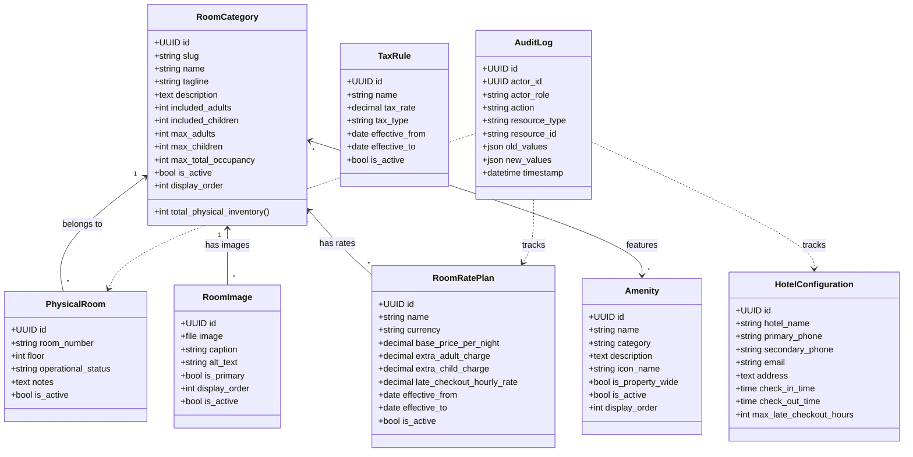

# Phase 2 Detailed Implementation Plan & Architecture Specification
## Admin Foundation + Hotel Master Data + Dynamic Configuration

> [!IMPORTANT]
> **Planning & Architecture Review Only**: This document outlines the corrected, authoritative architectural blueprint for Phase 2. **No Phase 2 implementation code is to be executed until formal review and approval.**

---

## 1. Phase 2 Objective

Phase 2 establishes the **administrative foundation and hotel master data systems** that all subsequent availability, booking engine, pricing calculation, payment, and reporting systems depend upon.

### Key Goals:
1. **Authoritative Room Categories & Dynamic Capacity**: Model `RoomCategory` with derived physical capacity (not an independently editable static count).
2. **Physical Room Inventory Architecture**: Design `PhysicalRoom` data model and administrative entry/management workflows without seeding invented room numbers into master data.
3. **Dynamic Pricing Master Data & Historical Versioning**: Model `RoomRatePlan` with effective date ranges (`effective_from`, `effective_to`, `is_active`) so rate adjustments never mutate past booking snapshots or rate histories.
4. **Centralized Hotel Configuration**: Model property-wide configuration (`HotelConfiguration`) for standard 11:00 AM check-in / check-out times, contact details, address, coordinates, and hotel policies.
5. **Dynamic Amenities & Flexible Media Storage**: Support uploaded files (`ImageField` / storage abstraction) with metadata, ordering, and category assignments.
6. **Granular Admin RBAC Matrix**: Enforce strict, client-aligned permissions distinguishing Owner (`SUPER_ADMIN`), Manager (`MANAGER`), and Receptionist (`RECEPTIONIST`) with unconfirmed capabilities explicitly flagged.
7. **Public vs. Admin API Separation**: Expose clean, customer-facing room information on public endpoints while keeping rate histories, administrative metadata, and audit logs restricted behind authenticated admin APIs.
8. **Audit Logging Foundation**: Immutable `AuditLog` capturing actor, role, action, resource type, resource ID, before/after JSON diffs, client IP, and timestamps.
9. **Admin Dashboard Shell**: Operational master-data overview reflecting actual Phase 2 entities (configured physical rooms, maintenance status, active categories, rate plans) without inventing fake booking/revenue metrics.

---

## 2. Current Architecture Dependencies

Phase 2 builds directly upon the validated **Phase 1 foundation**:
- **Authentication**: Custom `User` model (UUID PK, email auth), `CustomerProfile`, `StaffProfile` (roles: `superadmin`, `manager`, `receptionist`).
- **Session Security**: Django database-backed sessions with secure `HttpOnly`, `SameSite=Lax` cookies; CSRF protection via `/api/v1/auth/csrf/`.
- **API Standards**: Master `/api/v1/` routing with standardized JSON envelopes (`ApiResponse` and `ApiError`).
- **Frontend Architecture**: React 18, TypeScript, Vite, Tailwind CSS, React Router 6, Zustand, `apiClient` configured with `credentials: 'include'`.

---

## 3. Proposed Django Apps & Data Models

Phase 2 introduces three core modular apps and one shared core module:

```
backend/apps/
├── authentication/      # (Phase 1 Completed) User, CustomerProfile, StaffProfile
├── core/                # Shared utilities, standard envelopes, AuditLog
├── rooms/               # RoomCategory, PhysicalRoom, Amenity, RoomCategoryAmenity, RoomImage
├── pricing/             # RoomRatePlan, TaxRule (Master data foundation)
└── cms/                 # HotelConfiguration, CMSSection, GalleryMedia, FAQ
```



---

## 4. Corrected Model Specifications & Schema Attributes

### 4.1 `apps.rooms` Models

#### `RoomCategory`
- `id`: `UUIDField(primary_key=True, default=uuid4, editable=False)`
- `slug`: `SlugField(max_length=50, unique=True, db_index=True)` (e.g. `'ac-room'`, `'non-ac-room'`)
- `name`: `CharField(max_length=100)` (e.g. `'AC Room'`, `'Non-AC Room'`)
- `tagline`: `CharField(max_length=255, blank=True)` (e.g. `'Luxury Air-Conditioned Comfort'`)
- `description`: `TextField(blank=True)`
- **Occupancy Fields**:
  - `included_adults`: `PositiveIntegerField(default=2)`
  - `included_children`: `PositiveIntegerField(default=0)`
  - `max_adults`: `PositiveIntegerField(null=True, blank=True)` *(Not assumed/invented; null means capped by max_total_occupancy)*
  - `max_children`: `PositiveIntegerField(null=True, blank=True)`
  - `max_total_occupancy`: `PositiveIntegerField(default=4)` *(AC: 4 PAX confirmed; Non-AC: 2 PAX baseline, 3 PAX pending confirmation)*
- `display_order`: `PositiveIntegerField(default=0)`
- `is_active`: `BooleanField(default=True, db_index=True)`
- `created_at`: `DateTimeField(auto_now_add=True)`
- `updated_at`: `DateTimeField(auto_now=True)`

> [!NOTE]
> **Authoritative Derived Capacity Property**:
> ```python
> @property
> def total_physical_inventory(self):
>     return self.physical_rooms.filter(is_active=True, operational_status='operational').count()
> ```

#### `PhysicalRoom`
- `id`: `UUIDField(primary_key=True, default=uuid4, editable=False)`
- `category`: `ForeignKey(RoomCategory, on_delete=models.PROTECT, related_name='physical_rooms')`
- `room_number`: `CharField(max_length=20, unique=True, db_index=True)` (Entered manually/bulk by staff, e.g. `'101'`, `'102'`)
- `floor`: `IntegerField(default=1)`
- `operational_status`: `CharField(max_length=20, default='operational', choices=[('operational','Operational / Ready'),('maintenance','Under Maintenance'),('blocked','Admin Blocked'),('inactive','Inactive / Decommissioned')])`
- `notes`: `TextField(blank=True)`
- `is_active`: `BooleanField(default=True, db_index=True)`
- `created_at`: `DateTimeField(auto_now_add=True)`
- `updated_at`: `DateTimeField(auto_now=True)`

#### `Amenity`
- `id`: `UUIDField(primary_key=True, default=uuid4, editable=False)`
- `name`: `CharField(max_length=100, unique=True)`
- `category`: `CharField(max_length=20, choices=[('comfort','Comfort'),('convenience','Convenience'),('safety','Safety & Security'),('service','Hotel Service')])`
- `description`: `TextField(blank=True)`
- `icon_name`: `CharField(max_length=50, default='check')`
- `is_property_wide`: `BooleanField(default=False)`
- `is_active`: `BooleanField(default=True, db_index=True)`
- `display_order`: `PositiveIntegerField(default=0)`

#### `RoomCategoryAmenity` (M2M Link)
- `id`: `UUIDField(primary_key=True, default=uuid4, editable=False)`
- `category`: `ForeignKey(RoomCategory, on_delete=models.CASCADE, related_name='category_amenities')`
- `amenity`: `ForeignKey(Amenity, on_delete=models.CASCADE, related_name='category_links')`
- `highlight`: `BooleanField(default=False)`

#### `RoomImage` (Flexible Media Storage)
- `id`: `UUIDField(primary_key=True, default=uuid4, editable=False)`
- `category`: `ForeignKey(RoomCategory, on_delete=models.CASCADE, related_name='images')`
- `image`: `ImageField(upload_to='rooms/%Y/%m/', null=True, blank=True)` *(Supports local media and future S3/cloud storage)*
- `image_url`: `URLField(max_length=500, blank=True)` *(Optional external URL fallback)*
- `caption`: `CharField(max_length=200, blank=True)`
- `alt_text`: `CharField(max_length=200, blank=True)`
- `is_primary`: `BooleanField(default=False)`
- `display_order`: `PositiveIntegerField(default=0)`
- `is_active`: `BooleanField(default=True)`
- `created_at`: `DateTimeField(auto_now_add=True)`

---

### 4.2 `apps.pricing` Models (Master Data & Historical Versioning)

#### `RoomRatePlan`
- `id`: `UUIDField(primary_key=True, default=uuid4, editable=False)`
- `category`: `ForeignKey(RoomCategory, on_delete=models.PROTECT, related_name='rate_plans')`
- `name`: `CharField(max_length=100, default='Standard Tariff')`
- `currency`: `CharField(max_length=3, default='INR')`
- `base_price_per_night`: `DecimalField(max_digits=10, decimal_places=2)` *(Confirmed baseline: AC ₹1,599.00, Non-AC ₹1,299.00)*
- `extra_adult_charge`: `DecimalField(max_digits=10, decimal_places=2, default=350.00)` *(Confirmed: ₹350.00)*
- `extra_child_charge`: `DecimalField(max_digits=10, decimal_places=2, default=300.00)` *(Confirmed: ₹300.00)*
- `late_checkout_hourly_rate`: `DecimalField(max_digits=10, decimal_places=2, default=150.00)` *(Confirmed: AC ₹150.00, Non-AC ₹100.00)*
- `effective_from`: `DateField(null=True, blank=True)` *(Version validity start date)*
- `effective_to`: `DateField(null=True, blank=True)` *(Version validity end date)*
- `is_active`: `BooleanField(default=True, db_index=True)`
- `created_at`: `DateTimeField(auto_now_add=True)`
- `updated_at`: `DateTimeField(auto_now=True)`

> [!IMPORTANT]
> **Historical Integrity**: When rate modifications occur, existing `RoomRatePlan` records can be superseded by new versions or updated with effective date bounds. Past confirmed bookings remain permanently protected via `BookingPriceSnapshot`.

#### `TaxRule`
- `id`: `UUIDField(primary_key=True, default=uuid4, editable=False)`
- `name`: `CharField(max_length=100, default='GST')`
- `tax_rate`: `DecimalField(max_digits=5, decimal_places=2, default=5.00)` *(Confirmed: 5.00%)*
- `tax_type`: `CharField(max_length=20, default='percentage', choices=[('percentage','Percentage'),('fixed','Fixed Amount')])`
- `effective_from`: `DateField(null=True, blank=True)`
- `effective_to`: `DateField(null=True, blank=True)`
- `is_active`: `BooleanField(default=True, db_index=True)`
- `created_at`: `DateTimeField(auto_now_add=True)`
- `updated_at`: `DateTimeField(auto_now=True)`

---

### 4.3 `apps.cms` Models (Hotel Configuration & Media)

#### `HotelConfiguration` (Singleton Pattern)
- `id`: `UUIDField(primary_key=True, default=uuid4, editable=False)`
- `hotel_name`: `CharField(max_length=150, default='Manohar Grand Luxury Hotel Rooms')`
- `primary_phone`: `CharField(max_length=20, default='+91 7997044999')`
- `secondary_phone`: `CharField(max_length=20, default='+91 7997022999')`
- `email`: `EmailField(default='manohargrand1@gmail.com')`
- `address`: `TextField(default='Plot No: 11, Road No: 1, Vasantha Nagar Colony, Near J.N.T.U Metro Station, Kukatpally, Hyderabad, Telangana')`
- `near_landmark`: `CharField(max_length=150, default='Near J.N.T.U Metro Station, Kukatpally')`
- `google_maps_url`: `URLField(max_length=500, default='https://maps.app.goo.gl/bRAK5NEYvuFwctyo8?g_st=ac')`
- `google_maps_embed_url`: `URLField(max_length=1000, blank=True)`
- `standard_check_in_time`: `TimeField(default='11:00:00')` *(Confirmed: 11:00 AM)*
- `standard_check_out_time`: `TimeField(default='11:00:00')` *(Confirmed: 11:00 AM next day)*
- `max_late_checkout_hours`: `PositiveIntegerField(default=3)` *(Confirmed: max 3 hrs allowed)*
- `cancellation_policy_text`: `TextField(default='Bookings are strictly non-refundable once confirmed and advance payment is completed.')`
- `guest_id_policy_text`: `TextField(default='Original Aadhaar Card (or valid Govt. Photo ID) is mandatory for every guest at check-in.')`
- `age_policy_text`: `TextField(default='Primary guest must be 18 years of age or older to check in.')`
- `is_active`: `BooleanField(default=True)`
- `updated_at`: `DateTimeField(auto_now=True)`

#### `GalleryMedia` (Flexible Media Storage)
- `id`: `UUIDField(primary_key=True, default=uuid4, editable=False)`
- `title`: `CharField(max_length=150)`
- `category`: `CharField(max_length=30, choices=[('rooms','Guest Rooms'),('property','Hotel Property'),('amenities','Amenities'),('exterior','Building & Reception')])`
- `image`: `ImageField(upload_to='gallery/%Y/%m/', null=True, blank=True)`
- `image_url`: `URLField(max_length=500, blank=True)`
- `alt_text`: `CharField(max_length=200, blank=True)`
- `is_featured`: `BooleanField(default=False)`
- `display_order`: `PositiveIntegerField(default=0)`
- `is_active`: `BooleanField(default=True)`
- `created_at`: `DateTimeField(auto_now_add=True)`

#### `CMSSection`
- `id`: `UUIDField(primary_key=True, default=uuid4, editable=False)`
- `section_key`: `SlugField(max_length=50, unique=True, db_index=True)` (e.g. `'hero'`, `'welcome'`, `'experience'`, `'about'`)
- `title`: `CharField(max_length=200)`
- `subtitle`: `CharField(max_length=255, blank=True)`
- `body`: `TextField(blank=True)`
- `metadata`: `JSONField(default=dict, blank=True)`
- `is_active`: `BooleanField(default=True)`
- `updated_at`: `DateTimeField(auto_now=True)`

#### `FAQ`
- `id`: `UUIDField(primary_key=True, default=uuid4, editable=False)`
- `question`: `CharField(max_length=255)`
- `answer`: `TextField()`
- `category`: `CharField(max_length=50, default='general')`
- `display_order`: `PositiveIntegerField(default=0)`
- `is_active`: `BooleanField(default=True)`

---

### 4.4 `apps.core` Models (Audit Logging)

#### `AuditLog`
- `id`: `UUIDField(primary_key=True, default=uuid4, editable=False)`
- `actor`: `ForeignKey(User, on_delete=models.SET_NULL, null=True, blank=True, related_name='audit_entries')`
- `actor_email`: `EmailField(blank=True)`
- `actor_role`: `CharField(max_length=30, blank=True)`
- `action`: `CharField(max_length=30, choices=[('create','Created'),('update','Updated'),('delete','Deleted'),('status_change','Status Changed'),('price_change','Price Modified'),('config_change','Config Modified')])`
- `resource_type`: `CharField(max_length=50, db_index=True)` (e.g. `'PhysicalRoom'`, `'RoomRatePlan'`, `'TaxRule'`, `'HotelConfiguration'`)
- `resource_id`: `CharField(max_length=100, db_index=True)`
- `old_values`: `JSONField(default=dict, blank=True)`
- `new_values`: `JSONField(default=dict, blank=True)`
- `reason`: `TextField(blank=True)`
- `ip_address`: `GenericIPAddressField(null=True, blank=True)`
- `timestamp`: `DateTimeField(auto_now_add=True, db_index=True)`

---

## 5. Physical Room Inventory & Seed Architecture

### 5.1 No Invented Room Numbers in Master Data
- **The client has not yet supplied actual physical room numbers.**
- **Strict Rule**: The production/development master-data seeder will **NOT** create fake room records (e.g., `AC-01..20` or `NAC-01..08`).
- Master data seeding (`python manage.py seed_phase2_master_data`) will only create:
  1. The two confirmed `RoomCategory` records (`AC Room`, `Non-AC Room`).
  2. The initial active `RoomRatePlan` records (AC: ₹1,599, Non-AC: ₹1,299).
  3. The active `TaxRule` (GST 5%).
  4. The confirmed `HotelConfiguration` parameters.
  5. The confirmed property `Amenity` items.

### 5.2 Room Entry & Setup Workflow
- **Single Room Creation**: `POST /api/v1/admin/rooms/physical/` allows the SuperAdmin/Owner to create actual physical room numbers as they are assigned.
- **Bulk Setup / Import**: `POST /api/v1/admin/rooms/physical/bulk-setup/` accepts a list of real room numbers and assigns them to categories and floors.
- **Isolated Automated Test Fixtures**: Unit and API tests will use isolated test fixtures/factories (`pytest-django` database transactions) that populate test-only rooms during test execution and tear them down immediately. Fake test rooms can never enter production inventory.

---

## 6. Corrected Role-Based Access Control (RBAC) Matrix

Permissions explicitly reflect client-confirmed access vs. unconfirmed capabilities:

| Administrative Operation | `SUPER_ADMIN` (Owner) | `MANAGER` | `RECEPTIONIST` | Public / Customer |
| :--- | :---: | :---: | :---: | :---: |
| **View Room Categories & Public Details** | Yes | Yes | Yes | Yes |
| **View Physical Room List & Status** | Yes | Yes | Yes (Read-Only) | Denied (403) |
| **Change Room Operational Status (Maintenance)** | Yes | Yes | Pending Confirmation (Default: Denied) | Denied (403) |
| **Add New Physical Rooms** | Yes | Pending Confirmation (Default: Denied) | Denied (403) | Denied (403) |
| **Deactivate Physical Rooms** | Yes | Pending Confirmation (Default: Denied) | Denied (403) | Denied (403) |
| **Reassign Physical Room Category** | Yes | Denied (403) | Denied (403) | Denied (403) |
| **View Pricing & Rate Plans** | Yes | Yes (Read-Only) | Yes (Read-Only) | Denied (403) |
| **Modify Base Rates & Surcharges** | **Yes** | **Pending Confirmation (Default: Denied)** | **Denied (403)** | Denied (403) |
| **Modify GST Tax Rules** | Yes | Denied (403) | Denied (403) | Denied (403) |
| **Update Hotel Configuration & Timings** | Yes | Denied (403) | Denied (403) | Denied (403) |
| **Manage CMS Sections & Media** | Yes | Pending Confirmation (Default: Read-Only) | Denied (403) | Denied (403) |
| **Manage Amenities** | Yes | Yes | Denied (403) | Denied (403) |
| **Inspect System Audit Logs** | Yes | Yes (Read-Only) | Denied (403) | Denied (403) |

---

## 7. Public vs. Administrative API Boundary

### 7.1 Public Room Category API (`GET /api/v1/rooms/categories/`)
- **Strictly Customer-Facing**: Returns only active categories with current active pricing and customer-relevant details:
```json
{
  "success": true,
  "data": [
    {
      "id": "c1f72e9a-7a89-4e02-8d76-e17f0a8d6e01",
      "slug": "ac-room",
      "name": "AC Room",
      "tagline": "Luxury Air-Conditioned Comfort",
      "description": "Spacious premium room with individual remote AC...",
      "included_adults": 2,
      "max_total_occupancy": 4,
      "total_physical_inventory": 0,
      "current_price": {
        "currency": "INR",
        "base_price_per_night": "1599.00",
        "extra_adult_charge": "350.00",
        "extra_child_charge": "300.00",
        "late_checkout_hourly_rate": "150.00"
      },
      "amenities": [...],
      "images": [...]
    }
  ]
}
```
*(No rate plan IDs, no effective date history, no admin metadata, no internal audit IDs).*

### 7.2 Admin Pricing API (`/api/v1/admin/pricing/*`)
- **Restricted / Authenticated**: Exposes complete `RoomRatePlan` history, versioning controls, `TaxRule` records, and audit log associations.

---

## 8. Phase 2 Admin Dashboard Shell

The Phase 2 admin dashboard is an **operational master-data overview** backed strictly by Phase 2 data:
- **Total Room Categories**: Count of active categories (`AC Room`, `Non-AC Room`).
- **Configured Physical Rooms**: Total physical rooms entered in the system.
- **Operational Rooms**: Count of rooms in `operational` status.
- **Rooms Under Maintenance**: Count of rooms in `maintenance` or `blocked` status.
- **Active Rate Plans**: Overview of active base tariffs and extra guest charges.
- **Amenities Count**: Total verified property and category amenities.
- **Audit Activity Feed**: Latest 10 administrative updates with actor and timestamp.

*(No invented revenue, occupancy %, or booking metrics until Phase 3–6 systems exist).*

---

## 9. Testing Strategy for Phase 2

```
IMPLEMENT -> BUILD -> UNIT/MODEL TESTS -> API TESTS -> RBAC TESTS -> MANUAL SMOKE TEST -> APPROVE
```

1. **Model & Constraint Tests**:
   - `RoomCategory.total_physical_inventory` derived calculation.
   - Deletion protection (`on_delete=models.PROTECT`).
   - Unique constraints on `PhysicalRoom.room_number` and `RoomCategory.slug`.
2. **Pricing & History Tests**:
   - Rate plan creation and effective date query tests.
   - Verification that rate updates do not alter past historical records.
3. **Public API Envelope & Scrubbing Tests**:
   - Verify public endpoints do not leak internal pricing metadata or audit data.
4. **RBAC Permission Tests**:
   - Verify `MANAGER` cannot edit rates (pending confirmation baseline).
   - Verify `RECEPTIONIST` cannot add rooms or edit rates.
   - Verify `SUPER_ADMIN` has full operational access.
5. **Audit Logging Tests**:
   - Verify automatic audit log creation on room status or rate plan modification.

---

## 10. Unresolved Client Questions & Working Baselines

| # | Question / Topic | Conflict Detail | Current Working Baseline |
| :--- | :--- | :--- | :--- |
| 1 | **Non-AC Occupancy** | Direct statement: *"2 PAX only"* vs example: *"maximum 3 guests"*. | **2 PAX** max occupancy (flagged pending confirmation). |
| 2 | **Actual Room Numbers** | Exact physical room numbers not yet provided. | **No fake room numbers seeded.** Real numbers entered via admin setup. |
| 3 | **Manager Rate Editing** | Manager role confirmed as *"partial access"*; rate editing unconfirmed. | **Manager Rate Editing = Denied by default** (pending client confirmation). |
| 4 | **Manager Physical Room Setup** | Adding/decommissioning physical rooms unconfirmed for Manager. | **Manager Room Setup = Denied by default** (SuperAdmin only). |
| 5 | **Manager CMS Content Editing** | `10.ADMIN_PANEL_REQUIREMENTS.md` Table 3 designates CMS editing as SuperAdmin/Owner only; Manager editing unconfirmed. | **Manager CMS Editing = Read-Only** (pending client confirmation; SuperAdmin full access). |

---

## 11. Exact Phase 2 Implementation Sequence

```
Step 1: Core Utilities & Audit Logging App (`apps.core`) [COMPLETED]
        - AuditLog model, audit service helpers, IP extraction, migrations, admin.

Step 2: Room Categories & Physical Room Inventory (`apps.rooms`) [COMPLETED]
        - RoomCategory, PhysicalRoom models, derived inventory property, migrations, seed command (categories only, zero fake rooms).

Step 3: Amenities & Media Domain (`apps.rooms` & `apps.cms`) [COMPLETED - STEP 2 OF SPECIFICATION]
        - Implement Amenity, RoomCategoryAmenity, RoomImage (ImageField + validation + auto-primary demotion), GalleryMedia models, Django admin with inlines, idempotent amenity seeder.

Step 4: Dynamic Pricing, Tax & Hotel Configuration Master Data (`apps.pricing` & `apps.cms`) [COMPLETED - STEP 3 OF SPECIFICATION]
        - Implement RoomRatePlan (with effective dates and non-negative constraints), TaxRule (GST 5% baseline), HotelConfiguration (singleton pattern), Django admin with RBAC & audit logging, expanded idempotent seeder.

Step 5: Headless CMS Sections & FAQ (`apps.cms`) [COMPLETED - STEP 4 OF SPECIFICATION]
        - Implement CMSSection, FAQ models, Django admin with RBAC & audit logging, structural CMS seeder with zero fake data.

Step 6: REST API Serializers, Views & Routers [PENDING PHASE 2 STEP 5 APPROVAL]
        - Public endpoints: `/api/v1/rooms/categories/`, `/api/v1/content/*`.
        - Admin endpoints: `/api/v1/admin/rooms/*`, `/api/v1/admin/pricing/*`, `/api/v1/admin/content/*`, `/api/v1/admin/audit-logs/`.

Step 7: RBAC Permissions & Audit Signal Hooks [PENDING PHASE 2 STEP 6 APPROVAL]
        - Enforce `IsSuperAdmin`, `IsManagerOrAbove`, `IsStaffUser`. Connect post-save audit hooks.

Step 8: Master Data Seed Command Expansion [PENDING PHASE 2 STEP 7 APPROVAL]
        - Expand seed command to seed rates, tax rule, amenities, and hotel info (NO fake physical rooms).

Step 9: React Frontend Integration & Admin UI Shell [PENDING PHASE 2 STEP 8 APPROVAL]
        - Connect frontend dynamic room/amenities services; build `/admin/*` navigation, master-data dashboard & room setup shell.

Step 10: Automated Test Suite & Quality Verification [PENDING PHASE 2 STEP 9 APPROVAL]
        - Execute `pytest`, `python manage.py check`, `python manage.py makemigrations --check`, and `npm run build`.
```

---

## 12. Phase 2 Step 1 Completion Summary

- **Delivered**:
  - `core.models.AuditLog`: Append-only, UUID PK, actor FK, email/role snapshotting, JSON old/new values, IP address, index optimizations, read-only Django admin.
  - `core.services.record_audit_log`: Reusable helper for recording system and user audit entries.
  - `apps.rooms.models.RoomCategory`: UUID PK, unique slug, non-negative occupancy validators (`included_adults`, `included_children`, `max_adults`, `max_children`, `max_total_occupancy`), `active_physical_room_count` derived capacity helper.
  - `apps.rooms.models.PhysicalRoom`: UUID PK, unique `room_number`, `category` (FK PROTECT), operational status choices (`operational`, `maintenance`, `blocked`, `inactive`), indexed.
  - `seed_phase2_master_data`: Management command seeding only `AC Room` and `Non-AC Room` with **0 physical rooms**. Idempotent.
- **Migrations Applied**:
  - `core.0001_initial`
  - `rooms.0001_initial`
- **Automated Test Results**:
  - `36/36 tests passed` (20 Phase 1 tests + 16 Step 1 tests).

---

## 13. Phase 2 Step 2 Completion Summary (Amenities + Media Domain)

- **Delivered**:
  - `apps.rooms.models.Amenity`: UUID PK, unique name, category choices (`comfort`, `convenience`, `safety`, `service`), `icon_name`, `is_property_wide`, `display_order`, `is_active`.
  - `apps.rooms.models.RoomCategoryAmenity`: Explicit through-model between `RoomCategory` and `Amenity`, `UniqueConstraint(category, amenity)`, `is_highlight`, `display_order`.
  - `apps.rooms.models.RoomImage`: UUID PK, `category` FK (CASCADE), `image` (`ImageField` via Django storage abstraction), optional `image_url` fallback, `caption`, `alt_text`, `is_primary`, `display_order`, `is_active`, DB conditional unique constraint `unique_primary_active_image_per_category`, auto-demotion of previous primary images in `save()`, inactive cannot be primary validation.
  - `apps.cms.models.GalleryMedia`: UUID PK, `title`, category choices (`rooms`, `property`, `amenities`, `exterior`), `image` (`ImageField`), `image_url` fallback, `caption`, `alt_text`, `is_featured`, `display_order`, `is_active`.
  - `core.validators.validate_image_file`: Enforces max 5 MB, supported extensions (`.jpg`, `.jpeg`, `.png`, `.webp`), and MIME content types.
  - Django Admin: `AmenityAdmin`, `RoomCategoryAmenityAdmin`, `RoomImageAdmin`, `GalleryMediaAdmin`, and inlines `RoomCategoryAmenityInline`, `RoomImageInline` in `RoomCategoryAdmin`.
  - Seed Command: Updated `seed_phase2_master_data` to seed 10 verified amenities (e.g. Memory Foam Mattresses, 32" Smart TV, Free Wi-Fi, Lift, Generator Power Backup) idempotently without overwriting admin changes. **0 fake physical rooms, 0 fake room images, 0 fake gallery media**.
- **Migrations Applied**:
  - `cms.0001_initial`
  - `rooms.0003_amenity_roomcategoryamenity_roomcategory_amenities_and_more`
- **Automated Test Results**:
  - `59/59 tests passed in 27.61s (100% pass rate)`.

---

## 14. Phase 2 Step 3 Completion Summary (Pricing, Tax & Hotel Configuration Master Data)

- **Delivered**:
  - `apps.pricing.models.RoomRatePlan`: UUID PK, `category` FK (PROTECT), `name`, `currency` (INR), `base_price_per_night`, `extra_adult_charge` (₹350), `extra_child_charge` (₹300), `late_checkout_hourly_rate` (AC: ₹150, Non-AC: ₹100), `effective_from`, `effective_to`, `is_active`. Non-negative price validators, date ordering validation, and historical rate version preservation.
  - `apps.pricing.models.TaxRule`: UUID PK, `name`, `tax_rate` (5.00%), `tax_type` (percentage), `effective_from`, `effective_to`, `is_active`. Non-negative and maximum percentage validators, historical tax preservation.
  - `apps.cms.models.HotelConfiguration`: Singleton model (`get_solo()`), operational settings (`hotel_name='Manohar Grand'`, `standard_check_in_time='11:00:00'`, `standard_check_out_time='11:00:00'`, `max_late_checkout_hours=3`, `cancellation_policy_text='Once booking/payment is confirmed, booking cannot be cancelled/refunded.'`).
  - Django Admin & RBAC: `RoomRatePlanAdmin`, `TaxRuleAdmin`, `HotelConfigurationAdmin`. SuperAdmin has full modification access; Manager and Receptionist are restricted from mutating pricing/tax. All admin mutations create `AuditLog` records with before/after state diffs.
  - Master Seed Extension: `seed_phase2_master_data` seeds AC rate (₹1,599), Non-AC rate (₹1,299), GST 5%, and singleton Hotel Configuration idempotently, preserving existing admin modifications and generating **0 fake rooms, 0 fake media, 0 fake URLs**.
- **Migrations Applied**:
  - `pricing.0001_initial`
  - `cms.0002_hotelconfiguration`
- **Automated Test Results**:
  - `79/79 tests passed in 21.03s (100% pass rate)`.

---

## 15. Phase 2 Step 4 Completion Summary (Dynamic CMS & Hotel Content Master Data)

- **Delivered**:
  - `apps.cms.models.CMSSection`: UUID PK, unique `section_key`, `title`, `subtitle`, `body`, structured `metadata` JSON, `display_order`, `is_active`. Non-blank validation, whitespace cleaning, and deterministic ordering.
  - `apps.cms.models.FAQ`: UUID PK, `question`, `answer`, `category` choices (`general`, `booking`, `checkin_checkout`, `amenities`, `cancellation_refunds`, `location`), `display_order`, `is_active`. Non-blank validation and category-level ordering.
  - Django Admin & RBAC: `CMSSectionAdmin` and `FAQAdmin`. SuperAdmin has full add/change/delete access; Manager has read-only view access per `10.ADMIN_PANEL_REQUIREMENTS.md` Table 3 (pending confirmation baseline); Receptionist is Denied (403). All admin mutations emit `AuditLog` records capturing before/after diffs with zero secrets.
  - Master Seed Extension: `seed_phase2_master_data` seeds structural CMS sections (`hero`, `welcome`, `why-choose-us`) idempotently with client-confirmed details ("Walkable distance from JNTU Metro Station"). Zero unconfirmed FAQs seeded. Zero fake contact/social details.
- **Migrations Applied**:
  - `cms.0003_cmssection_faq`
- **Automated Test Results**:
  - `93/93 tests passed in 57.61s (100% pass rate)`.
  - `python manage.py check` $\to$ 0 issues identified.
  - `python manage.py makemigrations --check` $\to$ No changes detected.
  - `npm run build` $\to$ React frontend built cleanly in 21.00s with 0 errors.

---

## 16. Phase 2 Step 5 Completion Summary (REST API Foundation)

- **Delivered**:
  - **Public Room APIs** (`/api/v1/rooms/`):
    - `GET /api/v1/rooms/categories/`: Active room categories list with derived operational physical room counts, active amenities, active imagery, and active base rate pricing.
    - `GET /api/v1/rooms/categories/<slug>/`: Detailed specification including full rate breakdown (`pricing_details`).
    - `GET /api/v1/rooms/amenities/`: Active property amenities list.
  - **Public Headless CMS Content APIs** (`/api/v1/content/`):
    - `GET /api/v1/content/sections/` & `GET /api/v1/content/sections/<key>/`: Active marketing sections with structured JSON metadata.
    - `GET /api/v1/content/gallery/`: Active photo gallery items with `?category=` and `?featured=true` filters.
    - `GET /api/v1/content/faqs/`: Active FAQ accordion list with `?category=` filter.
    - `GET /api/v1/content/hotel-config/`: Public-safe singleton hotel operational configuration.
  - **Public Pricing & Tax APIs** (`/api/v1/pricing/`):
    - `GET /api/v1/pricing/rates/`: Public active room rate plans.
    - `GET /api/v1/pricing/taxes/`: Public active GST tax rules.
  - **Staff Admin APIs with RBAC & Audit Logging** (`/api/v1/admin/`):
    - `/api/v1/admin/rooms/physical-rooms/`: Staff list & SuperAdmin creation/deletion, Manager operational status update.
    - `/api/v1/admin/pricing/rates/` & `/api/v1/admin/pricing/taxes/`: Staff read-only view; SuperAdmin mutation.
    - `/api/v1/admin/content/sections/` & `/api/v1/admin/content/faqs/`: Manager read-only view; SuperAdmin mutation.
    - `/api/v1/admin/content/gallery/`: Manager & SuperAdmin media management.
    - `/api/v1/admin/content/hotel-config/`: Staff read-only view; SuperAdmin operational config updates.
    - `/api/v1/admin/audit-logs/`: Manager & SuperAdmin read-only audit inspection (strictly immutable).
- **Automated Test Results**:
  - `105/105 tests passed in 23.49s (100% pass rate)`.
  - `python manage.py check` $\to$ 0 issues identified.
  - `python manage.py makemigrations --check` $\to$ No changes detected.
  - `npm run build` $\to$ React frontend built cleanly in 6.15s with 0 errors.


